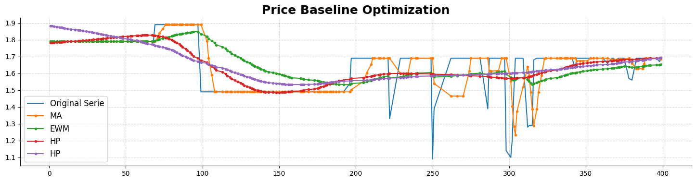
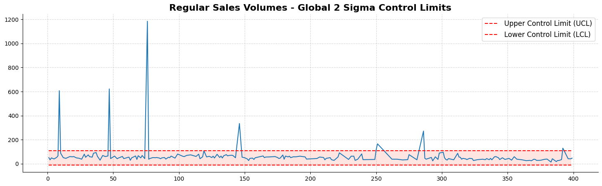
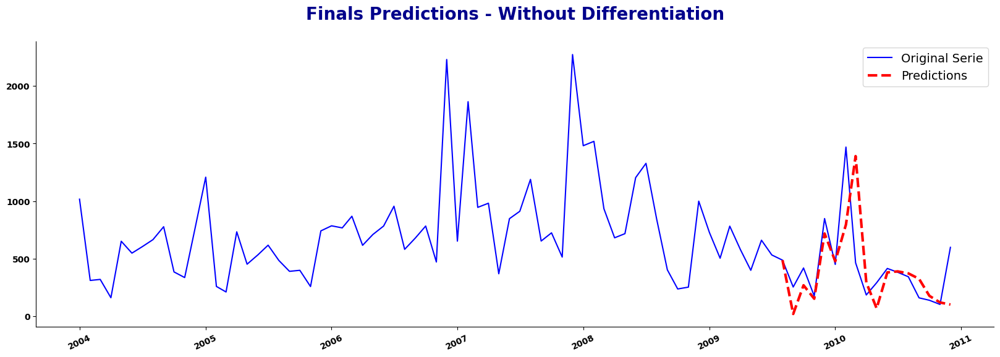

# Time Series Analysis & A/B Testing

This repository presents a complete end-to-end data science project that combines Time Series Forecasting and A/B Testing methodologies to evaluate the real impact of a marketing intervention over time.

By integrating statistical modeling, machine learning, and experimentation techniques, this project aims to separate the true effect of a marketing action from natural variations in the data.

## Project Overview

**Goal:** Estimate the causal impact of a marketing campaign by comparing actual performance with a synthetic baseline generated from forecasting models.

Approach:

* Build time series models to predict expected values without the intervention.
* Compare actual results to the forecast to measure uplift.
* Validate results statistically using A/B testing methodologies.

### Retail Promo Impact & Baseline Modeling

**Objective:** Quantify the true incremental lift of discount strategies by isolating organic sales trends from promotional spikes.

Techniques used:
 * Hodrick-Prescott (HP) Filter for trend-cycle decomposition to extract a smooth sales baseline.
 * Differentiation between "Business as usual" sales and promotion-driven volume.
 * Calculation of Price Elasticity and Sales Ratios to measure promotional efficiency.
 * Dynamic thresholding to identify significant deviations (Lift) caused by price reductions.

 
  

### Time Series Forecasting

**Objective:** Create a reliable model to forecast baseline values in the absence of the marketing action.

Techniques used:

* Data visualization & decomposition
* Stationarity testing (Augmented Dickey-Fuller test)
* Differencing to remove trends/seasonality
* ARIMA and SARIMA modeling
* Hyperparameter tuning (grid search)
* Prophet modeling with external regressors (e.g., weather, marketing spend)

Example Result – ARIMA Forecast:

 

### A/B Testing & Evaluation

* Statistical comparison between observed results and predicted baseline
* Confidence interval estimation for uplift
* Consideration of seasonality, holidays, and external factors to avoid biased conclusions

### Key Learnings & Insights

* The importance of stationarity in time series modeling
* How to perform seasonal decomposition and differencing
* How to simulate a control group using synthetic data
* How to combine forecasting models with hypothesis testing to assess business impact
* Practical workflow for integrating ML & statistical methods in a real-world pipeline
